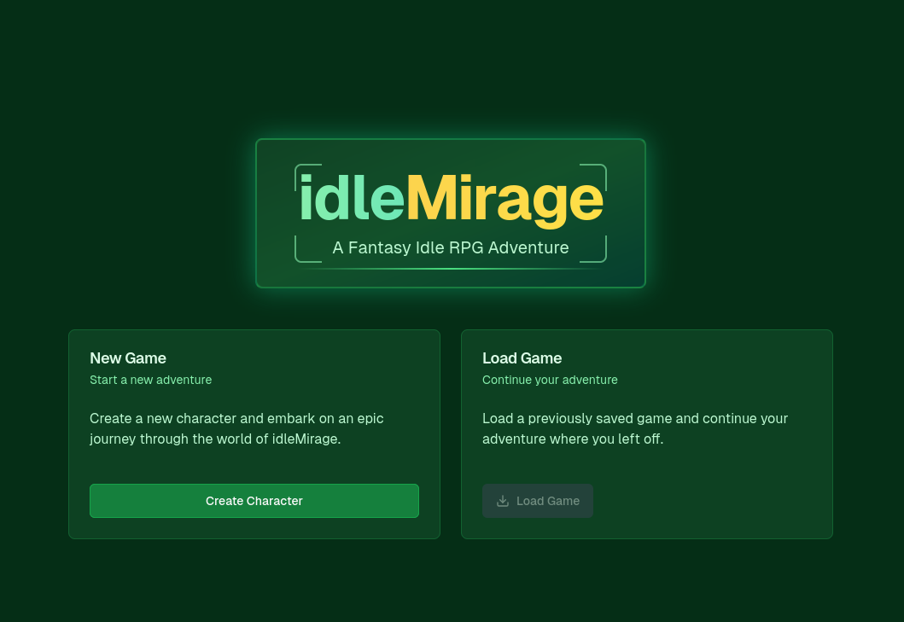
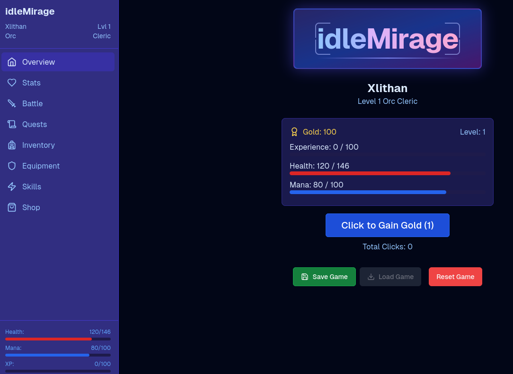

# idleMirage
**Core concept built with the help of AI, v0.dev**

**Beta source is now avaiable, will slowly make updates/refactoring and work on documentation** 
**Example game to see it in action: https://simonsquest.vercel.app/**

idleMirage is an idle clicker framework following the legacy of Mirage Source for aspiring developers or hobbyists to develop their own single player web game.

idleMirage will include your basic RPG template and features including quests, shops, and leveling up. 

Inspired by the classic web multiplayer games of the 90s and early 00s, idleMirage is here to bring back that magic and nostalgia for people who enjoy playing PBBGs and games like Melvor Idle but want to make their own.

Stay tuned for upcoming updates/features as well as my own personal game using idleMirage in the near future.

Follow my blog for news/info regarding idleMirage and the games I'll be making @ https://blog.nikkix.me

## Features
 - Traditional turn based Combat
 - Quests
 - Player Classes and Races
 - Save and Load System

## How to Install
**Prerequisites: node.js, npm** 

- npm i (Or anyway for you to install dependencies)
- npm run dev
- navigate to localhost:3000

Coming Soon